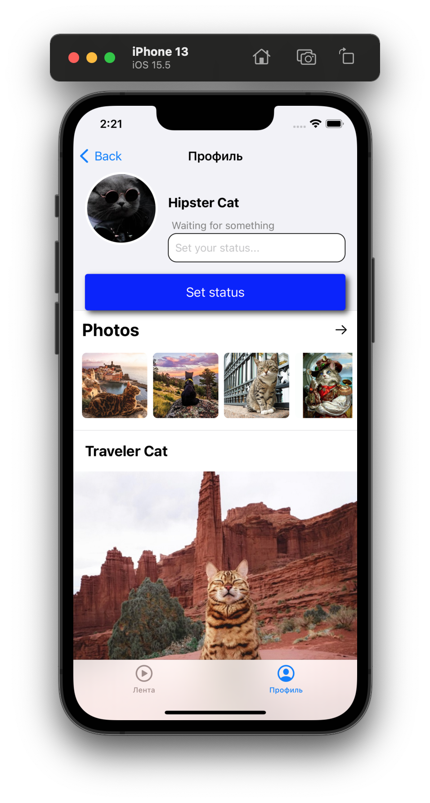

# Дипломный проект. «iOS Пользовательский интерфейс»

1.1 Дизайн и пользовательский интерфейс

1.2 Инструменты для разработки интерфейса

1.3 Навигация в iOS и жизненный цикл UIViewController

2.1 Базовые UI компоненты

2.2 Верстка экранов для iOS. Auto Layout

2.3 UITableView, UIScrollView, datasource и delegate

2.5 CollectionView

2.6 Жесты и анимация

[Оф.ссылка](https://github.com/netology-code/iosui-homeworks/tree/iosui-8)
